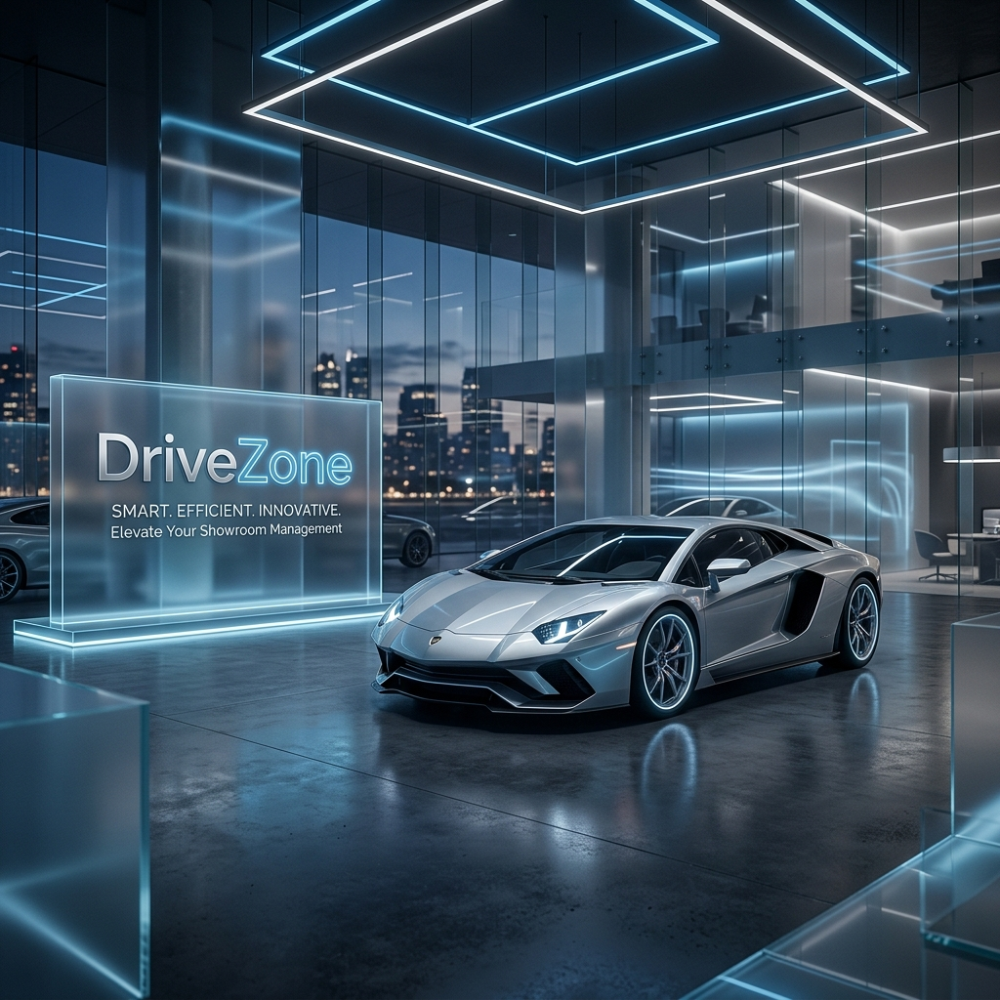
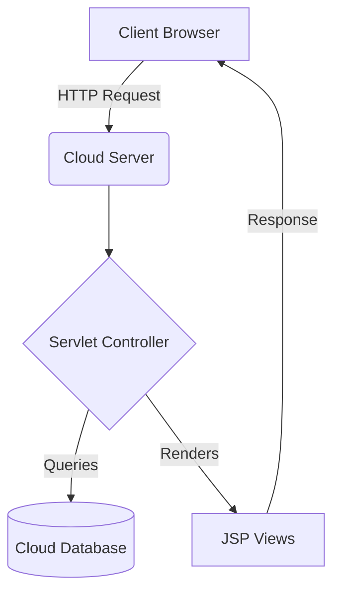

<div align="center">
  
  
  # 🚗 DriveZone
  ### *Premium Car Showroom Management System*
  
  <p align="center">
    
    
    
    
  </p>

  ---
  
  **DriveZone** is a high-performance Java Web Application designed for the modern automotive industry. 
  It streamlines inventory management, customer engagement, and administrative workflows with a sleek, responsive interface.
  
  [**Explore Features**](#-key-features) • [**Setup Guide**](#-quick-start) • [**Architecture**](#-project-architecture)
</div>

<br />

## ✨ Key Features

<details open>
<summary><b>🛡️ Role-Based Access Control</b></summary>
<br />
Secure authentication for both regular users and dealership administrators, ensuring data integrity and restricted access to sensitive management tools.
</details>

<details>
<summary><b>🏎️ Dynamic Inventory Management</b></summary>
<br />
A powerful dashboard for administrators to add, modify, or retire vehicle listings in real-time with instant UI updates.
</details>

<details>
<summary><b>🌓 Premium UI/UX</b></summary>
<br />
Fully responsive design with a persistent Light/Dark mode toggle, tailored for a premium user experience across all devices.
</details>

<details>
<summary><b>📩 Smart Enquiry System</b></summary>
<br />
Integrated communication channel for customers to request details or book test drives for specific vehicles.
</details>

<br />

## 🛠️ Technology Stack

| Layer | Technologies |
| :--- | :--- |
| **Frontend** | HTML5, CSS3 (Glassmorphism), JavaScript, FontAwesome |
| **Backend** | Java Servlets, JSP (JavaServer Pages) |
| **Database** | MySQL (Optimized Schema) |
| **Server** | Apache Tomcat 9.0+ |

<br />

## 🚀 Quick Start

1. **Clone the repository:**
   ```bash
   git clone https://github.com/yourusername/DriveZone.git
   ```
2. **Database Setup:**
   - Import `setup_instructions.sql` into your MySQL instance (via XAMPP).
3. **Server Configuration:**
   - Deploy the `Drive_zone` project to your Tomcat server.
   - Access via `http://localhost:8080/Drive_zone`.

<br />

## 📂 Project Architecture



<br />

## 🚀 Public Deployment (Railway.app)

Deploy your project publicly in minutes using **Railway**:

1.  **Prepare your Database**:
    - On Railway, click **New** > **Database** > **Add MySQL**.
    - Copy the **Connection URL**, **User**, and **Password**.
2.  **Deploy the App**:
    - Click **New** > **GitHub Repo** > Select this repository.
    - Go to **Variables** in your project settings and add:
        - `DB_URL`: Your Railway MySQL Connection URL.
        - `DB_USER`: Your MySQL Username.
        - `DB_PASS`: Your MySQL Password.
3.  **Automatic Build**: 
    - Railway will detect the `Dockerfile` and `pom.xml`, build the project using Maven, and deploy it to a public URL.

---

<div align="center">
  <sub>Built for Excellence. DriveZone &copy; 2024.</sub>
</div>