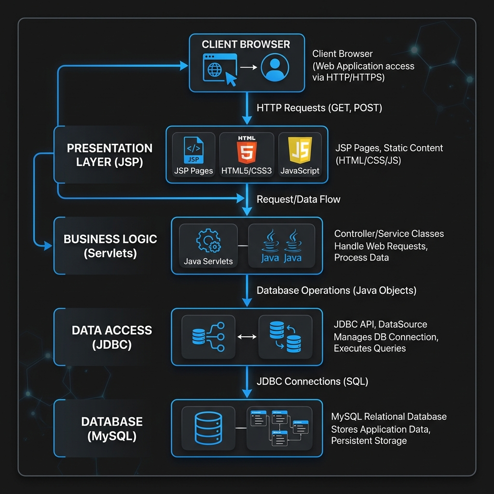
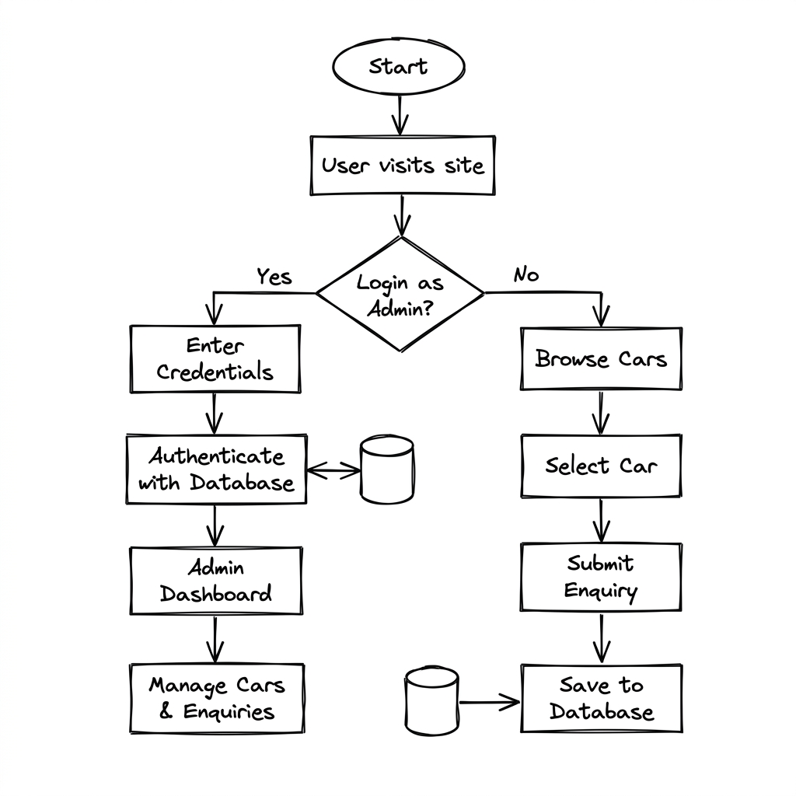
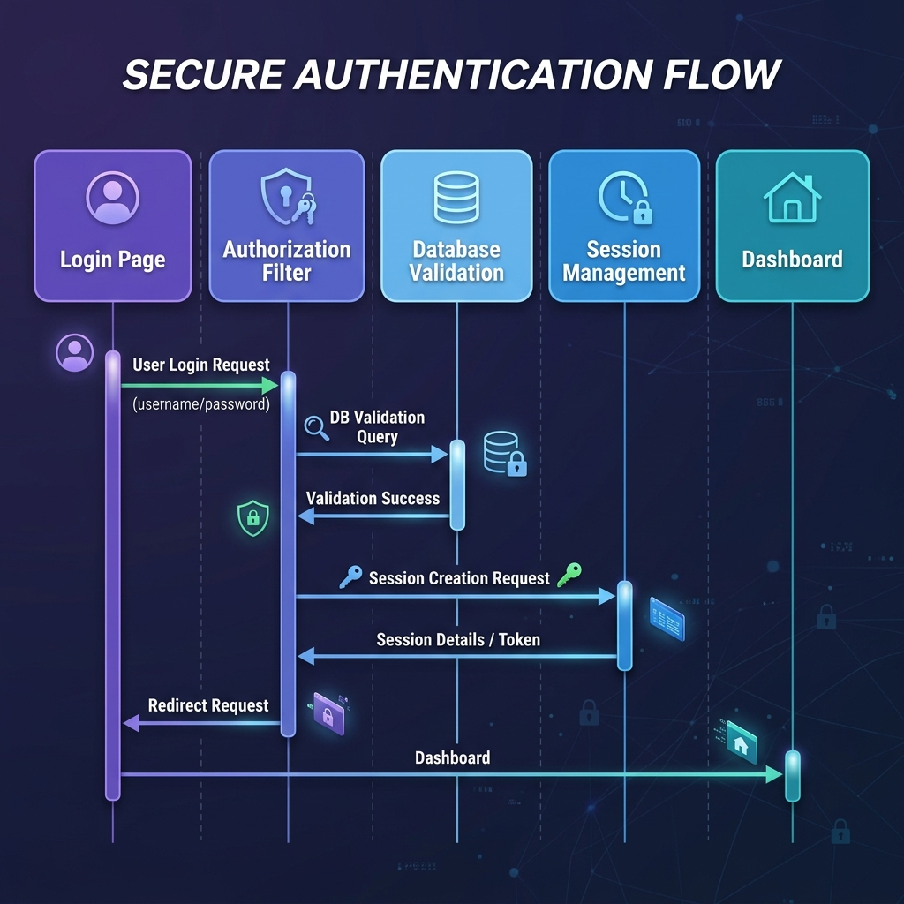
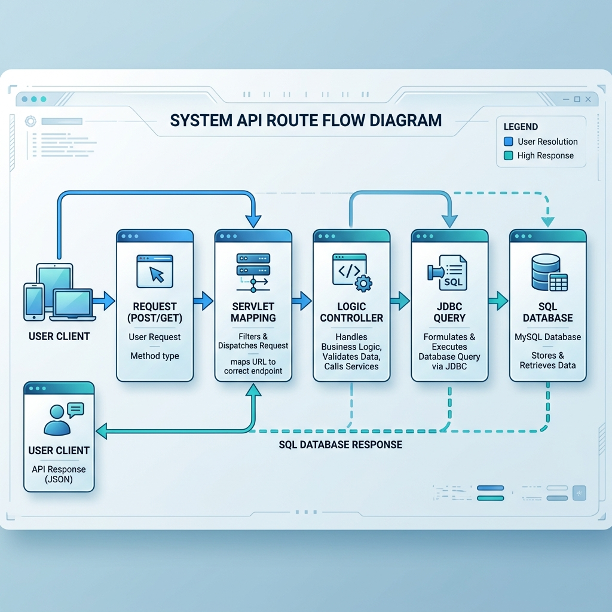
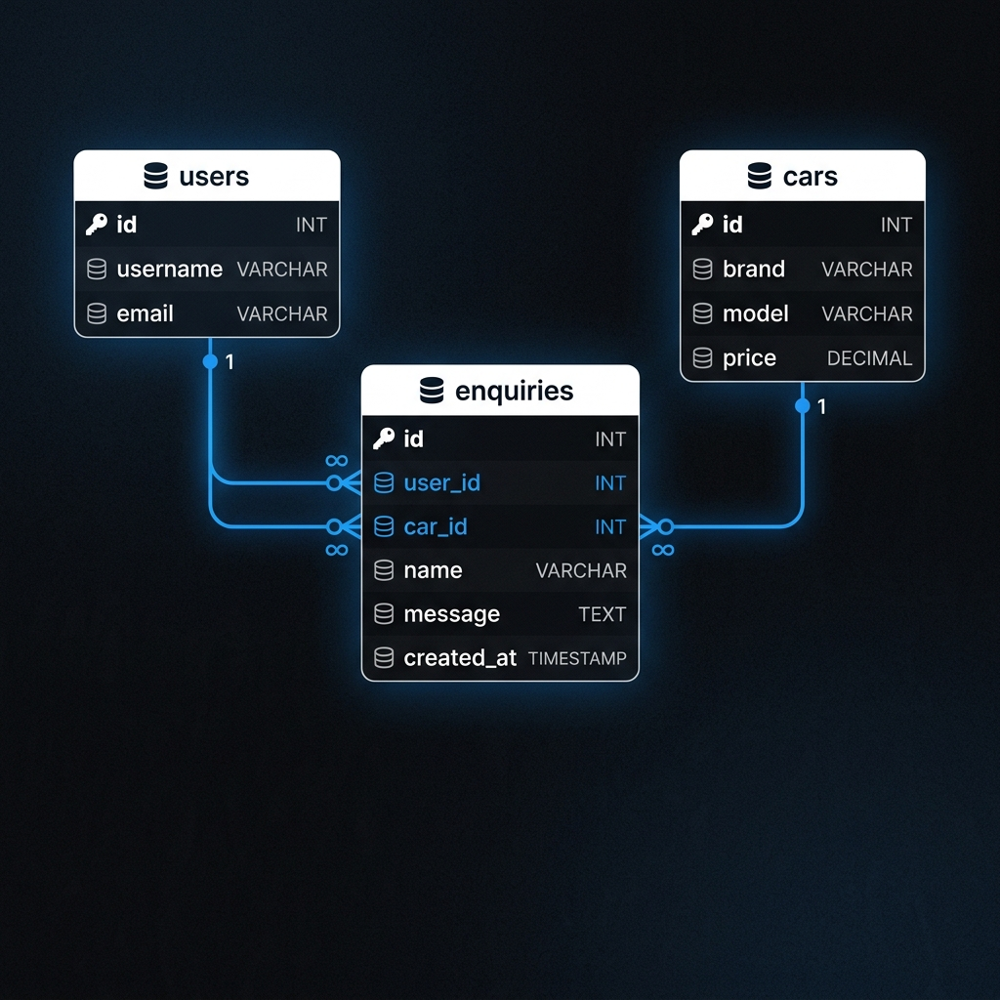
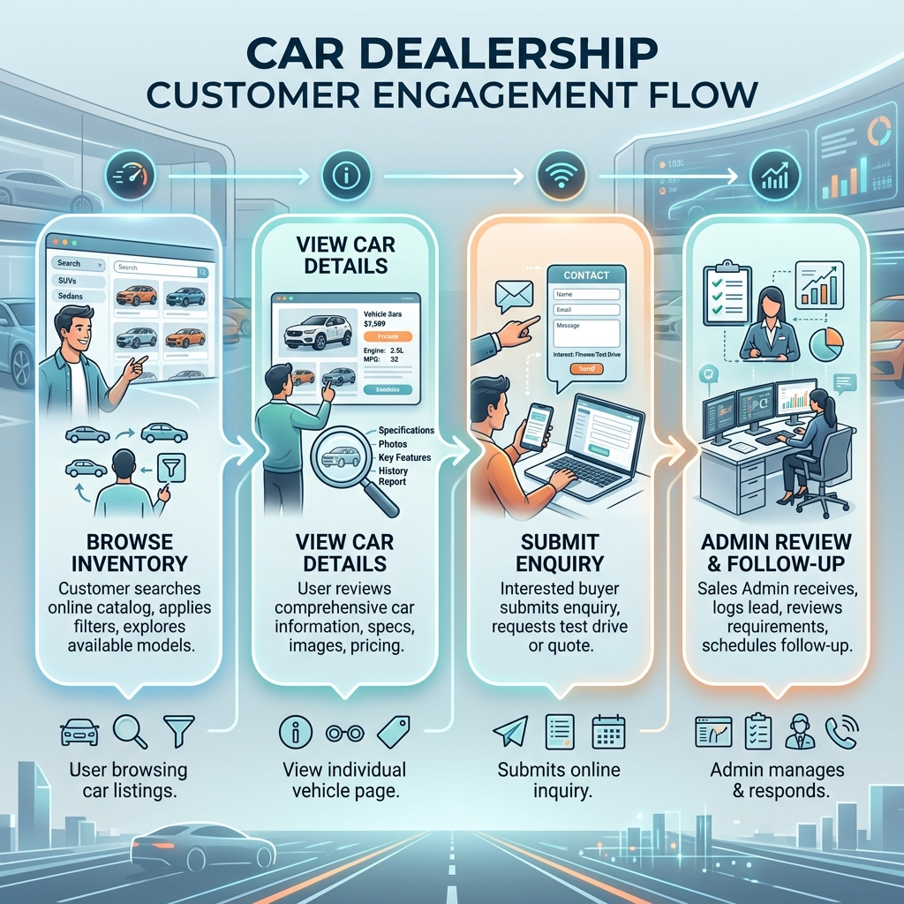
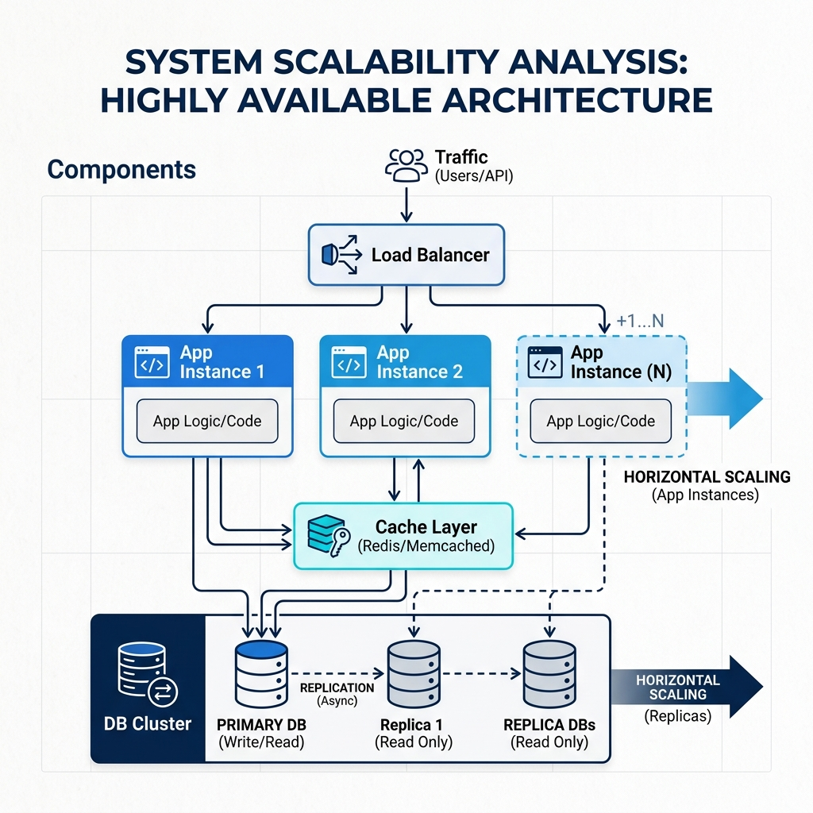

<div align="center">


# DriveZone

### Enterprise Car Showroom Management Platform

<p align="center">
  
  
  
  
</p>

<p align="center">
A scalable Java web application for vehicle inventory management, customer enquiries, dealership operations, and secure administrative workflows.
</p>

</div>

---

## Overview

DriveZone is a full-stack showroom management system developed using Java Servlets, JSP, MySQL, and Apache Tomcat.  
The platform centralizes dealership workflows including inventory handling, authentication, enquiry management, and customer interaction through a modern responsive interface.

---

## Core Features

- Secure Authentication & Session Management
- Vehicle Inventory Administration
- Customer Enquiry Processing
- Responsive Premium UI
- Role-Based Access Control
- Scalable MVC Architecture

---

## Technology Stack

| Layer | Technologies |
|---|---|
| Frontend | HTML5, CSS3, JavaScript |
| Backend | Java Servlets, JSP |
| Database | MySQL |
| Server | Apache Tomcat |
| Architecture | MVC Pattern |

---

# System Architecture

<div align="center">
  
</div>

---

# Application Workflow

<div align="center">
  
</div>

---

# Authentication Flow

<div align="center">
  
</div>

---

# API Workflow

<div align="center">
  
</div>

---

# Database Design

<div align="center">
  
</div>

---

# Enquiry Management

<div align="center">
  
</div>

---

# Scalability Architecture

<div align="center">
  
</div>

---

## Project Structure

```bash
DriveZone/
│
├── assets/
│   └── images/
│
├── src/
├── webapp/
├── database/
├── pom.xml
└── README.md
```

---

## Deployment

```bash
git clone https://github.com/yourusername/DriveZone.git
```

### Configure Database

```sql
CREATE DATABASE drivezone;
```

### Run Application

```bash
http://localhost:8080/DriveZone
```

---

## Security Highlights

- Prepared Statements
- Session-Based Authentication
- Protected Admin Routes
- Input Validation
- Secure MVC Separation

---

<div align="center">

### DriveZone © 2026

Enterprise Java Web Application

</div>